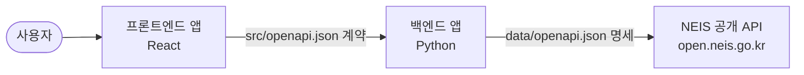

# TRD: 급식 배틀 - 학교 급식 조회 앱

이 문서는 [`PRD.md`](./PRD.md)에서 정의한 요구사항을 개발팀이 실제로 구현할
수 있도록 기술 상세를 기술하는 기술 요구사항 문서(Technical Requirements
Document)입니다.

## 1. 시스템 아키텍처

애플리케이션은 프론트엔드 UI 앱과 백엔드 API 앱으로 구성하며, 두 앱은
Docker Compose로 오케스트레이션합니다.

### 1.1 컴포넌트 책임

| 컴포넌트 | 기술 | 책임 |
|----------|------|------|
| 프론트엔드 앱 | React | 학교 검색 👉 날짜 선택 👉 결과 표시의 3단계 UI 제공, 백엔드 API 호출 및 응답 표시 |
| 백엔드 앱 | Python | NEIS API 호출, 응답 변환, 프론트엔드에 조회 결과 제공 |
| NEIS 공개 API | 외부 서비스 | 학교 기본 정보 및 급식 식단 정보 제공 |

### 1.2 제약 사항

- 프론트엔드는 NEIS API를 직접 호출하지 않습니다. 모든 급식·학교 데이터는
  백엔드 API를 통해서만 조회합니다.
- NEIS API 인증 키는 백엔드에서만 사용하며 환경 변수로 주입합니다. 코드,
  로그, 커밋에 포함하지 않습니다.

## 2. 외부 API 연동 (NEIS)

백엔드는 [`data/openapi.json`](./data/openapi.json) 명세를 근거로 NEIS API와
통신하며, 이 명세를 별도의 클라이언트 코드로 구현합니다.

- 기본 URL: `https://open.neis.go.kr`
- 사용 엔드포인트:

| 엔드포인트 | 용도 | 주요 파라미터 |
|------------|------|---------------|
| `GET /hub/schoolInfo` | 부분 학교명으로 학교 검색 | `SCHUL_NM`(학교명 부분 일치), `Key`, `Type`, `pIndex`, `pSize` |
| `GET /hub/mealServiceDietInfo` | 날짜 범위의 급식 조회 | `ATPT_OFCDC_SC_CODE`(교육청 코드), `SD_SCHUL_CODE`(학교 코드), `MMEAL_SC_CODE`(식사 코드, 중식은 `2`), `MLSV_FROM_YMD`/`MLSV_TO_YMD`(조회 시작일/종료일, `YYYYMMDD`) |

- 학교 검색 결과에서 얻은 `ATPT_OFCDC_SC_CODE`와 `SD_SCHUL_CODE`를 급식
  조회 요청에 사용합니다.
- 중식 기준 조회이므로 급식 조회 시 `MMEAL_SC_CODE=2`를 사용합니다.
- NEIS 응답의 급식 메뉴 문자열(`DDISH_NM`)에 포함된 구분자(` ` 등)와
  알레르기 표기를 파싱하여 원문의 의미를 보존한 채 프론트엔드가 표시하기
  쉬운 구조로 변환합니다. 외부 응답을 신뢰하지 않고 검증하며, 원문 HTML을
  그대로 화면에 삽입하지 않습니다.
- NEIS 오류 응답(결과 없음 `INFO-200` 포함)을 구분하여 처리하고, 오류를
  성공 값처럼 반환하지 않습니다.

### 2.1 요청 효율 및 외부 API 보호

- 학교 검색은 빈 검색어를 거부하고, 프론트엔드는 사용자가 검색을 실행한
  경우에만 요청합니다. 입력 중 자동 검색을 제공하는 경우 디바운스하고,
  이전 요청을 취소하거나 가장 최근 응답만 반영하여 중복 호출과 오래된
  응답의 화면 반영을 방지합니다.
- 학교 검색은 `pIndex`와 `pSize`를 사용하는 페이지 단위로 처리하고, NEIS
  명세의 최대 요청 건수(`pSize` 1,000건)를 넘기지 않습니다. 내부 API 계약은
  다음 페이지 조회에 필요한 페이지 정보와 전체 건수를 전달합니다.
- 백엔드 NEIS 클라이언트는 연결을 요청마다 새로 만들지 않고 재사용하며,
  명시적인 연결·응답 타임아웃을 설정합니다. 비동기 처리 경로에서는 블로킹
  I/O를 사용하지 않습니다.
- 일시적인 네트워크 오류나 제한 응답을 재시도한다면 횟수를 제한하고
  지수 백오프를 적용합니다. 잘못된 요청이나 `INFO-200`은 재시도하지
  않습니다.

## 3. 프론트엔드·백엔드 간 계약

- 백엔드 앱의 엔드포인트와 데이터 스키마는 별도로 `src` 디렉토리에 생성할
  `openapi.json` 문서를 통해 정의합니다.
- 프론트엔드 앱은 이 `src/openapi.json` 명세를 별도의 클라이언트 코드로
  구현하여 백엔드와 통신합니다.
- 백엔드 API는 최소한 다음 기능을 제공해야 합니다.
  - 부분 학교명으로 학교 목록 검색 (학교 이름, 교육청 코드, 학교 코드,
    학교급, 소재지 포함)
  - 학교 식별자(교육청 코드 + 학교 코드)와 날짜 범위(시작일, 종료일)로
    중식 기준 날짜별 급식 목록 조회

### 3.1 데이터 흐름

1. 사용자가 학교 이름 일부를 입력하면 프론트엔드가 백엔드의 학교 검색
   API를 호출합니다.
2. 백엔드는 NEIS `GET /hub/schoolInfo`를 호출한 뒤 결과를 도메인 형식으로
   변환하여 반환합니다.
3. 사용자가 학교를 선택하고 날짜 범위를 지정하면 프론트엔드가 백엔드의
   급식 조회 API를 호출합니다.
4. 백엔드는 NEIS `GET /hub/mealServiceDietInfo`를 호출한 뒤 날짜별 급식
   목록으로 변환하여 반환합니다.
5. 프론트엔드는 응답을 날짜별로 렌더링합니다.

### 3.2 오류 처리

- 백엔드는 잘못된 입력(빈 검색어, 종료일이 시작일보다 앞선 날짜 범위 등)에
  적절한 4xx 응답과 오류 사유를 반환합니다.
- NEIS API 실패는 백엔드에서 명시적으로 처리해 프론트엔드에 오류 상태로
  전달하고, 결과 없음(검색 결과 없음, 급식 정보 없음)은 오류가 아닌 빈
  결과로 구분하여 반환합니다.
- 프론트엔드는 API 호출의 로딩, 성공, 실패 상태를 명시적으로 처리하고
  Promise 오류를 무시하지 않습니다.

## 4. 실행 및 배포 구성

- 프론트엔드 앱과 백엔드 앱은 각각 컨테이너 이미지로 빌드합니다.
- 루트의 Docker Compose 구성으로 두 앱을 함께 빌드·실행합니다.
  - 백엔드 서비스: NEIS API 키를 환경 변수로 주입받아 실행합니다.
  - 프론트엔드 서비스: 백엔드 서비스의 주소를 구성값으로 주입받아
    백엔드와 통신합니다.
- 실제 API 키 값이 들어 있는 환경 파일은 커밋하지 않습니다.
- 컨테이너 간 통신은 Docker Compose 서비스 이름을 사용하며, 프론트엔드가
  브라우저에서 접근할 공개 백엔드 주소와 컨테이너 내부 주소를 구분하여
  구성합니다.

## 5. 테스트 전략

| 대상 | 테스트 종류 | 내용 |
|------|-------------|------|
| 프론트엔드 앱 | 통합테스트 | 학교 검색 👉 날짜 선택 👉 결과 표시 UI 흐름을 백엔드 API 모킹 기반으로 검증합니다. 검색 결과 없음, 잘못된 날짜 범위, 급식 정보 없음, API 오류 등 예외 상황 표시를 포함합니다. |
| 백엔드 앱 | 단위테스트 | NEIS 응답 파싱·변환, 입력 검증, 오류 분기 등 개별 로직을 검증합니다. |
| 백엔드 앱 | 통합테스트 | NEIS API를 모킹한 상태에서 백엔드 API 엔드포인트의 정상 경로와 실패 경로를 검증합니다. |
| 전체 앱 | E2E 테스트 | Docker Compose로 실행한 환경에서 학교 검색부터 급식 결과 표시까지 전체 사용자 흐름을 검증합니다. |

- 프론트엔드는 통합테스트만 작성하고 별도의 단위테스트는 작성하지
  않습니다.
- 테스트에서 실제 NEIS API 키를 사용하지 않도록 외부 호출은 모킹합니다.
- 통합테스트에는 페이지 이동, 연속 검색 시 최신 응답만 반영되는지, NEIS
  타임아웃 및 제한 응답이 올바른 오류로 변환되는지를 포함합니다.

## 6. 코드 품질 지침

- 저장소 루트의 [`AGENTS.md`](./AGENTS.md)에 정의된 Python 및 TypeScript
  지침을 따릅니다.
- 공개 인터페이스에는 구체적인 타입을 사용하고, 외부 API 응답과 사용자
  입력은 신뢰 경계에서 검증한 뒤 도메인 타입으로 변환하여 사용합니다.
